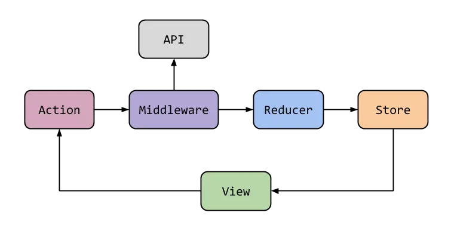
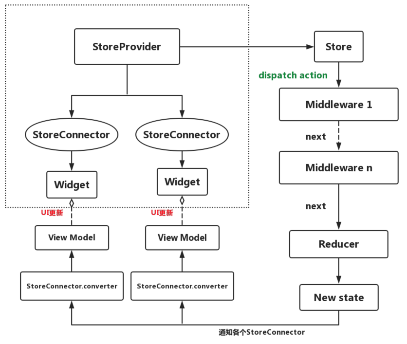

# 前言

高仿京东商城flutter版本，个人学习flutter项目

1. 使用flutter_redux状态管理
2. 网络使用dio进行了简单的封装
3. 使用node项目mock服务端接口(mock_server目录)
4. 目前只实现了首页、分类、购物车、我的，持续更新中...

* ### 同款Android Kotlin版本（ https://github.com/GuoguoDad/jd_mall.git ）
* ### 参考学习书籍《Flutter实战·第二版》（ https://book.flutterchina.club/ ）
*

# flutter_redux

1. 封装需要共享的数据
2. 封装需要发送的消息（同时也有区分动作的作用）
3. 数据修改与分发
4. 声明 store
5. 接受与更新
6. 触发

# 启动mock_server

1. cd mock_server
2. 执行 npm i 安装依赖
3. npm run mock

# 效果

## 首页

|

## 分类

## 购物车

[1](https://p1-juejin.byteimg.com/tos-cn-i-k3u1fbpfcp/b01bf300da3c496a8e896383cfd13122~tplv-k3u1fbpfcp-watermark.image)

## 我的

# 第三方框架

| 库                          | 功能       |
| -------------------------- |----------|
| **dio**                    | **网络框架** |
| **shared_preferences**     | **本地数据缓存** |
| **flutter_redux**          | **redux** |
| **device_info**            | **设备信息** |
| **connectivity**           | **网络链接** |
| **json_annotation**        | **json模板** |
| **json_serializable**      | **json模板** |
| **photo_view**             | **图片预览** |
| **path_provider**          | **本地路径** |
| **cached_network_image**   | **图片显示** |

# 声明

⚠️本APP仅限于学习交流使用，请勿用于其它商业用途

⚠️项目中使用的图片及字体等资源如有侵权请联系作者删除

⚠️如使用本项目代码造成侵权与作者无关
