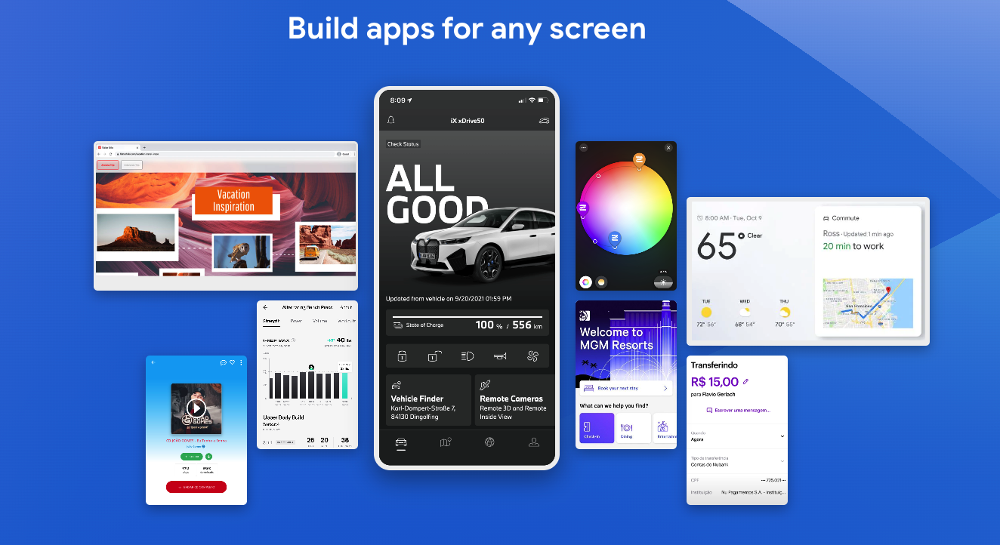
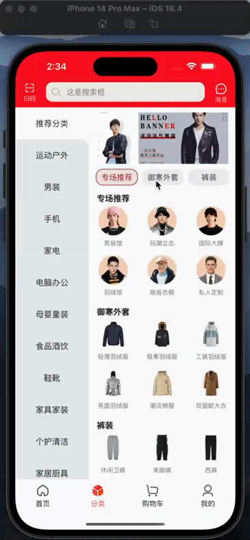
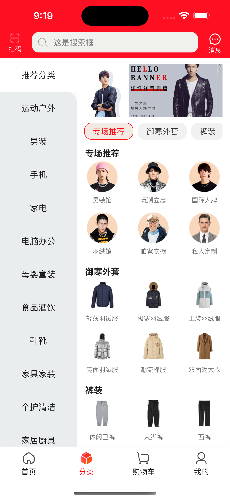
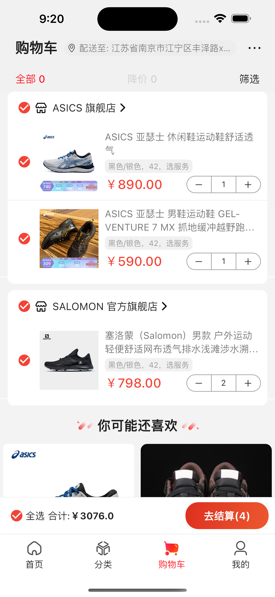
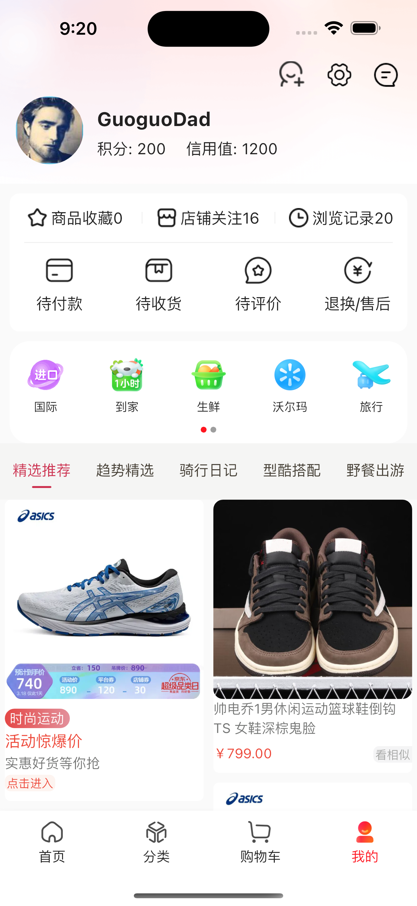
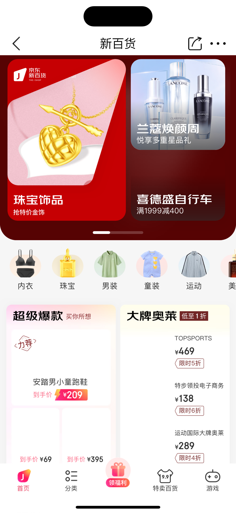

# 前言

高仿京东商城flutter版本，个人学习flutter项目

1. 集成GetX解决方案(状态管理、依赖注入、路由管理、国际化)
2. 网络使用dio进行封装
3. 集成Sentry进行线上异常捕获
4. 使用node项目mock服务端接口(mock_server目录)
5. 目前实现了首页、分类、购物车、我的，商品详情、webview加载模块...

* ### 同款Android Kotlin版本（ https://github.com/GuoguoDad/jd_mall.git ）
* ### 参考学习书籍《Flutter实战·第二版》（ https://book.flutterchina.club/ ）

# 关于运行
  flutter版本:3.29.0     
  XCode:16.2      
  Android Studio Ladybug Feature Drop | 2024.2.2 Patch 2   
  mock_server nodejs: v18.20.6

# flutter 简介

Flutter 是 Google 推出的一款开源的 UI 工具包，用于构建高性能、高保真度的移动、Web 和桌面应用程序。Flutter
使用自己的渲染引擎来绘制
UI，从而提供更快的性能和更好的用户体验。Flutter 还提供了丰富的构建工具、库和插件，使得开发者可以更快速地构建应用程序。



Flutter框架具有如下的一些特点：

1. 渲染引擎可以提供高性能的 UI 渲染，支持 60fps 的动画效果，性能堪比原生。
2. 多端体验一致性强，因为他有自己的渲染引擎，脱离原生那套UI束缚。
3. 使用 Dart 语言，具有强类型、高效和易于学习的特点，基本上，你会写JS，这个上手很快。
4. 支持快速迭代和热重载，使得开发者可以更快速地进行开发，Ctrl+S马上就看到你的变更。
5. 支持跨平台开发，可以在 Android、iOS、Web 和桌面上运行，真正的全平台，可谓是一网打尽。
6. 提供了丰富的 UI 组件和插件，使得开发者可以更快速地构建应用程序。社区插件也非常丰富
   ，pub.dev，基本上你能想到的所有插件他都有，就是算没有，自己懂Android和iOS开发，封装一个也非常简单，都有套路模版。

# GetX

GetX 是 Flutter 上的一个轻量且强大的解决方案：高性能的状态管理、智能的依赖注入和便捷的路由管理。

- GetX 有3个基本原则：

    - **性能：** GetX 专注于性能和最小资源消耗。GetX打包后的apk占用大小和运行时的内存占用与其他状态管理插件不相上下。
    - **效率：** GetX 的语法非常简捷，并保持了极高的性能，能极大缩短你的开发时长。
    - **结构：** GetX 可以将界面、逻辑、依赖和路由完全解耦，用起来更清爽，逻辑更清晰，代码更容易维护。

## 简单示例

GetX 写一个计数器，实现：

- 每次点击都能改变状态
- 在不同页面之间切换
- 在不同页面之间共享状态
- 将业务逻辑与界面分离

```dart
class Controller extends GetxController {
  var count = 0.obs;

  increment() => count++;
}
```

```dart
class Home extends StatelessWidget {

  @override
  Widget build(context) {
    // 使用Get.put()实例化你的类，使其对当下的所有子路由可用。
    final Controller c = Get.put(Controller());

    return Scaffold(
      // 使用Obx(()=>每当改变计数时，就更新Text()。
        appBar: AppBar(title: Obx(() => Text("Clicks: ${c.count}"))),

        // 用一个简单的Get.to()即可代替Navigator.push那8行，无需上下文！
        body: Center(child: ElevatedButton(
            child: Text("Go to Other"), onPressed: () => Get.to(Other()))),
        floatingActionButton:
        FloatingActionButton(child: Icon(Icons.add), onPressed: c.increment));
  }
}

class Other extends StatelessWidget {
  // 你可以让Get找到一个正在被其他页面使用的Controller，并将它返回给你。
  final Controller c = Get.find();

  @override
  Widget build(context) {
    // 访问更新后的计数变量
    return Scaffold(body: Center(child: Text("${c.count}")));
  }
}
```

# 启动本地mock_server

main_dev 走本地mock， main_prd 走远程mock服务

1. cd mock_server
2. 执行 npm i 安装依赖
3. npm run mock

# 运行

## 运行开发环境应用程序

      flutter run -t lib/main_dev.dart

## 运行生产环境应用程序

      flutter run -t lib/main_prd.dart

## 打包开发环境应用程序

      flutter build apk -t lib/main_dev.dart
      flutter build ios -t lib/main_dev.dart

## 打包生产环境应用程序

      flutter build apk --release -t lib/main_prd.dart
      flutter build ios --release -t lib/main_prd.dart
      flutter build web --release -t lib/main_prd.dart --web-renderer html

## 性能分析

      flutter run --profile lib/main_prd.dart

## 排序import语句

      dart run import_sorter:main

## flutter_native_splash开屏页
      dart run flutter_native_splash:create

# 效果

## 首页


## 分类




## 购物车




## 我的




## 商品详情


## webview 加载h5




# 第三方框架

| 库                        | 功能         |
|--------------------------|------------|
| **dio**                  | **网络框架**   |
| **shared_preferences**   | **本地数据缓存** |
| **flutter_redux**        | **redux**  |
| **device_info**          | **设备信息**   |
| **connectivity_plus**    | **网络链接**   |
| **json_annotation**      | **json模板** |
| **json_serializable**    | **json模板** |
| **photo_view**           | **图片预览**   |
| **path_provider**        | **本地路径**   |
| **cached_network_image** | **图片显示**   |

# 声明

⚠️本APP仅限于学习交流使用，请勿用于其它商业用途

⚠️项目中使用的图片及字体等资源如有侵权请联系作者删除

⚠️如使用本项目代码造成侵权与作者无关

## 请作者喝杯coffee


